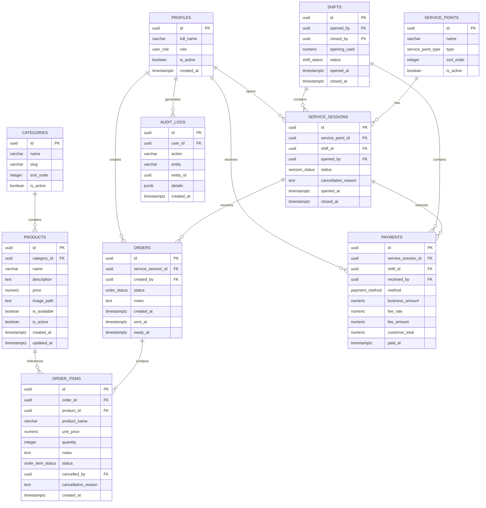

# ERD v1 — KUCHI'S

## 1. Objetivo

Este documento define la primera versión del **modelo entidad-relación (ERD)** de KUCHI'S.

El modelo está diseñado para soportar:

- KUCHI'S Clientes.
- KUCHI'S Logístico.
- Catálogo de productos.
- Usuarios y roles.
- Puntos de servicio.
- Sesiones de atención.
- Comandas.
- Productos por comanda.
- Pagos.
- Turnos.
- Auditoría.

La base de datos será PostgreSQL desplegada mediante Supabase.

---

# 2. Principios del modelo

## 2.1. Puntos de servicio

Se utiliza `service_points` en lugar de una tabla limitada a mesas.

Esto permite representar:

- mesas;
- posiciones de barra;
- futuros puntos de atención.

Tipos iniciales:

```text
TABLE
BAR
```

---

## 2.2. Ocupación de un punto de servicio

`service_points.is_active` **no indica si una mesa está ocupada**.

Significa que el punto está habilitado para ser utilizado dentro del sistema.

Ejemplo:

```text
Mesa 7
is_active = true
```

significa que Mesa 7 existe y puede utilizarse.

Para determinar si está ocupada:

```text
¿Existe una service_session OPEN asociada?

Sí  -> Ocupada
No  -> Libre
```

---

## 2.3. Sesiones de atención

Una mesa física existe permanentemente, pero puede ser utilizada muchas veces.

Por eso se separan:

```text
service_points
```

de:

```text
service_sessions
```

Ejemplo:

```text
Mesa 7
|
+-- Sesión #001
|   18:20 -> 19:05
|
+-- Sesión #002
|   19:30 -> 20:10
|
+-- Sesión #003
    20:45 -> ...
```

Cada sesión representa una atención distinta.

---

## 2.4. Historial de precios

El precio actual del producto vive en:

```text
products.price
```

Sin embargo, al crear una venta el precio se copia en:

```text
order_items.unit_price
```

Esto evita que una modificación futura del precio altere ventas antiguas.

Ejemplo:

```text
19/08
Salchipapa = S/10

20/08
Nuevo precio = S/12
```

La venta del 19/08 seguirá almacenada como S/10.

---

## 2.5. Soft delete

Los productos y puntos de servicio no se eliminarán físicamente si ya tienen historial.

Se utilizará:

```text
is_active = false
```

Esto permite conservar las relaciones históricas.

---

## 2.6. Simulación del cliente

Las simulaciones realizadas en KUCHI'S Clientes no se almacenarán en PostgreSQL durante el MVP.

La simulación se manejará temporalmente desde el frontend.

```text
Productos
+
Cantidades
+
Método de pago
+
Cálculo estimado
```

No genera:

- comanda;
- sesión de atención;
- pago;
- venta.

---

# 3. Diagrama entidad-relación



---

# 4. Entidades

## 4.1. `profiles`

Representa la información interna de cada trabajador.

Las credenciales de autenticación serán administradas por Supabase Auth.

| Campo | Tipo | Descripción |
|---|---|---|
| `id` | UUID | Identificador del perfil. Relacionado con Supabase Auth. |
| `full_name` | VARCHAR | Nombre completo del trabajador. |
| `role` | ENUM | Rol asignado al usuario. |
| `is_active` | BOOLEAN | Indica si la cuenta interna está habilitada. |
| `created_at` | TIMESTAMPTZ | Fecha y hora de creación. |

### Roles iniciales

```text
ADMIN
CASHIER
HALL
GRILL
```

---

# 4.2. `categories`

Agrupa los productos de la carta.

Ejemplos:

- Salchipapas.
- Hamburguesas.
- Combos.
- Bebidas.

| Campo | Tipo | Descripción |
|---|---|---|
| `id` | UUID | Identificador de la categoría. |
| `name` | VARCHAR | Nombre visible. |
| `slug` | VARCHAR | Identificador amigable para URLs y código. |
| `sort_order` | INTEGER | Orden visual. |
| `is_active` | BOOLEAN | Indica si la categoría está habilitada. |

---

# 4.3. `products`

Representa cada producto vendido por KUCHI'S.

| Campo | Tipo | Descripción |
|---|---|---|
| `id` | UUID | Identificador del producto. |
| `category_id` | UUID FK | Categoría a la que pertenece. |
| `name` | VARCHAR | Nombre visible. |
| `description` | TEXT | Descripción del producto. |
| `price` | NUMERIC(10,2) | Precio actual. |
| `image_path` | TEXT | Ruta de la imagen en Supabase Storage. |
| `is_available` | BOOLEAN | Indica si actualmente puede venderse. |
| `is_active` | BOOLEAN | Indica si sigue formando parte del sistema. |
| `created_at` | TIMESTAMPTZ | Fecha de creación. |
| `updated_at` | TIMESTAMPTZ | Última modificación. |

### Diferencia entre disponibilidad y actividad

```text
is_available = false
```

Ejemplo:

> Se acabó la chicha por hoy.

```text
is_active = false
```

Ejemplo:

> Este producto ya no forma parte de la carta.

---

# 4.4. `service_points`

Representa los puntos físicos donde se atiende a clientes.

Tipos iniciales:

```text
TABLE
BAR
```

| Campo | Tipo | Descripción |
|---|---|---|
| `id` | UUID | Identificador del punto de servicio. |
| `name` | VARCHAR | Nombre visible, por ejemplo `Mesa 1`. |
| `type` | ENUM | `TABLE` o `BAR`. |
| `sort_order` | INTEGER | Posición visual dentro de la interfaz. |
| `is_active` | BOOLEAN | Indica si puede utilizarse actualmente. |

Datos iniciales:

```text
Mesa 1
Mesa 2
Mesa 3
Mesa 4
Mesa 5
Mesa 6
Mesa 7

Barra 1
Barra 2
Barra 3
Barra 4
```

---

# 4.5. `shifts`

Representa los turnos operativos de caja.

| Campo | Tipo | Descripción |
|---|---|---|
| `id` | UUID | Identificador del turno. |
| `opened_by` | UUID FK | Usuario que abrió el turno. |
| `closed_by` | UUID FK | Usuario que cerró el turno. |
| `opening_cash` | NUMERIC(10,2) | Efectivo inicial de caja. |
| `status` | ENUM | Estado del turno. |
| `opened_at` | TIMESTAMPTZ | Fecha y hora de apertura. |
| `closed_at` | TIMESTAMPTZ | Fecha y hora de cierre. |

Estados iniciales:

```text
OPEN
CLOSED
```

---

# 4.6. `service_sessions`

Representa una atención concreta ocurrida en un punto de servicio.

Ejemplo:

> Mesa 7 fue utilizada entre 20:10 y 21:05.

| Campo | Tipo | Descripción |
|---|---|---|
| `id` | UUID | Identificador de la sesión. |
| `service_point_id` | UUID FK | Mesa o barra utilizada. |
| `shift_id` | UUID FK | Turno en el que ocurrió. |
| `opened_by` | UUID FK | Usuario que abrió la atención. |
| `status` | ENUM | Estado de la sesión. |
| `cancellation_reason` | TEXT | Motivo si fue cancelada. |
| `opened_at` | TIMESTAMPTZ | Hora de apertura. |
| `closed_at` | TIMESTAMPTZ | Hora de cierre. |

Estados iniciales:

```text
OPEN
AWAITING_PAYMENT
PAID
CANCELLED
```

---

# 4.7. `orders`

Representa una comanda.

Una misma sesión puede tener múltiples comandas.

Ejemplo:

```text
Mesa 7

Comanda #001
- Salchipapa
- Chicha

Comanda #002
- Hamburguesa
```

| Campo | Tipo | Descripción |
|---|---|---|
| `id` | UUID | Identificador de la comanda. |
| `service_session_id` | UUID FK | Atención a la que pertenece. |
| `created_by` | UUID FK | Usuario que creó la comanda. |
| `status` | ENUM | Estado actual. |
| `notes` | TEXT | Observaciones generales. |
| `created_at` | TIMESTAMPTZ | Momento de creación. |
| `sent_at` | TIMESTAMPTZ | Momento de envío a parrilla. |
| `ready_at` | TIMESTAMPTZ | Momento en que quedó lista. |

Estados iniciales:

```text
PENDING
PREPARING
READY
CANCELLED
```

---

# 4.8. `order_items`

Representa cada producto contenido dentro de una comanda.

| Campo | Tipo | Descripción |
|---|---|---|
| `id` | UUID | Identificador del item. |
| `order_id` | UUID FK | Comanda a la que pertenece. |
| `product_id` | UUID FK | Producto original. |
| `product_name` | VARCHAR | Nombre copiado al momento de la venta. |
| `unit_price` | NUMERIC(10,2) | Precio congelado al momento de la venta. |
| `quantity` | INTEGER | Cantidad solicitada. |
| `notes` | TEXT | Observaciones específicas. |
| `status` | ENUM | Estado del item. |
| `cancelled_by` | UUID FK | Usuario que anuló el item. |
| `cancellation_reason` | TEXT | Motivo de anulación. |
| `created_at` | TIMESTAMPTZ | Fecha y hora de creación. |

Estados iniciales:

```text
ACTIVE
CANCELLED
```

---

# 4.9. `payments`

Representa los pagos realizados por una sesión de atención.

Una sesión podrá tener más de un pago en el futuro.

Ejemplo:

```text
S/20 efectivo
S/20 Yape
```

| Campo | Tipo | Descripción |
|---|---|---|
| `id` | UUID | Identificador del pago. |
| `service_session_id` | UUID FK | Sesión que se está pagando. |
| `shift_id` | UUID FK | Turno asociado. |
| `received_by` | UUID FK | Usuario que registró el pago. |
| `method` | ENUM | Método de pago. |
| `business_amount` | NUMERIC(10,2) | Monto correspondiente a KUCHI'S. |
| `fee_rate` | NUMERIC(5,4) | Porcentaje adicional del POS. |
| `fee_amount` | NUMERIC(10,2) | Monto adicional cobrado. |
| `customer_total` | NUMERIC(10,2) | Total pagado por el cliente. |
| `paid_at` | TIMESTAMPTZ | Momento del pago. |

Métodos iniciales:

```text
CASH
YAPE
CARD
```

Ejemplo tarjeta:

```text
business_amount = 40.00
fee_rate        = 0.05
fee_amount      = 2.00
customer_total  = 42.00
```

---

# 4.10. `audit_logs`

Mantiene trazabilidad de operaciones sensibles.

Ejemplos:

- cambio de precio;
- anulación de producto;
- cancelación de mesa;
- modificación administrativa.

| Campo | Tipo | Descripción |
|---|---|---|
| `id` | UUID | Identificador del evento. |
| `user_id` | UUID FK | Usuario que realizó la acción. |
| `action` | VARCHAR | Acción realizada. |
| `entity` | VARCHAR | Tipo de entidad afectada. |
| `entity_id` | UUID | Identificador del registro afectado. |
| `details` | JSONB | Información adicional. |
| `created_at` | TIMESTAMPTZ | Momento del evento. |

Ejemplo:

```json
{
  "old_price": 10.00,
  "new_price": 12.00
}
```

---

# 5. Enumeraciones iniciales

## `user_role`

```text
ADMIN
CASHIER
HALL
GRILL
```

## `service_point_type`

```text
TABLE
BAR
```

## `shift_status`

```text
OPEN
CLOSED
```

## `session_status`

```text
OPEN
AWAITING_PAYMENT
PAID
CANCELLED
```

## `order_status`

```text
PENDING
PREPARING
READY
CANCELLED
```

## `order_item_status`

```text
ACTIVE
CANCELLED
```

## `payment_method`

```text
CASH
YAPE
CARD
```

---

# 6. Relaciones principales

## Categorías y productos

```text
categories
    |
    +----< products
```

Una categoría puede tener muchos productos.

Cada producto pertenece a una categoría.

---

## Puntos de servicio y sesiones

```text
service_points
    |
    +----< service_sessions
```

Un punto de servicio puede tener muchas sesiones a lo largo del tiempo.

Cada sesión pertenece a un único punto de servicio.

---

## Turnos y sesiones

```text
shifts
    |
    +----< service_sessions
```

Un turno puede contener muchas sesiones de atención.

Cada sesión ocurre dentro de un turno.

---

## Sesiones y comandas

```text
service_sessions
    |
    +----< orders
```

Una sesión puede tener múltiples comandas.

---

## Comandas y productos

```text
orders
    |
    +----< order_items
```

Cada comanda contiene uno o más items.

---

## Productos y items vendidos

```text
products
    |
    +----< order_items
```

Un producto puede aparecer en muchas ventas.

---

## Sesiones y pagos

```text
service_sessions
    |
    +----< payments
```

Una sesión puede registrar uno o varios pagos.

---

# 7. Reglas de negocio importantes

## 7.1. Una sesión abierta por punto

Un punto de servicio no podrá tener dos sesiones abiertas simultáneamente.

Ejemplo inválido:

```text
Mesa 7
|
+-- service_session OPEN
|
+-- service_session OPEN
```

---

## 7.2. Cantidades positivas

```text
order_items.quantity > 0
```

---

## 7.3. Precios no negativos

```text
products.price >= 0
order_items.unit_price >= 0
payments.business_amount >= 0
payments.fee_amount >= 0
payments.customer_total >= 0
```

---

## 7.4. Producto histórico

Al crear un `order_item`, el backend copiará:

```text
products.name
products.price
```

hacia:

```text
order_items.product_name
order_items.unit_price
```

---

## 7.5. Cancelaciones

Si un item es cancelado:

```text
status = CANCELLED
```

se deberá registrar:

- usuario;
- motivo;
- fecha;
- auditoría cuando corresponda.

---

## 7.6. Cierre de sesión

Una sesión pagada deberá registrar:

```text
status = PAID
closed_at != null
```

---

## 7.7. Tarjeta

Cuando el método sea tarjeta:

```text
customer_total = business_amount + fee_amount
```

El recargo POS no forma parte del ingreso real de KUCHI'S.

---

# 8. Flujo de ejemplo

```text
1. Se abre un turno
        |
        v
2. Se abre Mesa 7
        |
        v
3. Se crea una service_session
        |
        v
4. Salón crea una comanda
        |
        v
5. Se agregan order_items
        |
        v
6. Parrilla recibe la comanda
        |
        v
7. PENDING -> PREPARING -> READY
        |
        v
8. Cliente pide la cuenta
        |
        v
9. Sesión -> AWAITING_PAYMENT
        |
        v
10. Caja registra payment
        |
        v
11. Sesión -> PAID
        |
        v
12. Mesa 7 vuelve a estar libre
```

---

# 9. KUCHI'S Clientes y este modelo

KUCHI'S Clientes consultará principalmente:

```text
categories
products
```

La simulación no modificará la base de datos.

Flujo:

```text
Cliente
   |
   v
Frontend público
   |
   v
Backend API
   |
   +--> categories
   |
   +--> products
```

---

# 10. Próximo paso

Después de aprobar este ERD v1 se creará la primera migración:

```text
supabase/migrations/001_initial_schema.sql
```

La migración deberá incluir:

1. Extensiones necesarias.
2. Enumeraciones.
3. Tablas.
4. Claves primarias.
5. Claves foráneas.
6. Restricciones `CHECK`.
7. Índices.
8. Restricción para una sola sesión abierta por punto.
9. Valores por defecto.
10. Datos iniciales de puntos de servicio cuando corresponda.

---

# 11. Estado

```text
ERD: v1
Estado: Diseño inicial aprobado para implementación
Base de datos objetivo: PostgreSQL / Supabase
```
