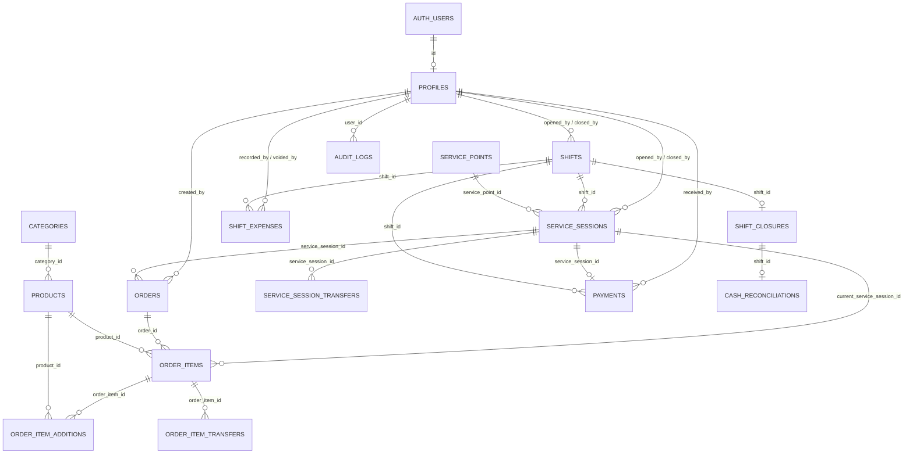

# ERD v2 FINAL — KUCHI'S

## 1. Estado y fuentes de verdad

**Estado:** alineado con el backend V1 actual

**Base de datos:** PostgreSQL en Supabase

**Fecha de revisión:** 2026-08-27

Este documento describe el modelo físico vigente. Sus fuentes de verdad son,
en este orden:

1. `supabase/migrations/`
2. `packages/shared/database.types.ts`
3. repositories y servicios de `apps/api`

El inventario comprende las 16 tablas de negocio del schema `public`.
`auth.users` pertenece a Supabase Auth y se relaciona con `profiles`, pero no se
cuenta como tabla propia de KUCHI'S.

## 2. Principios estructurales

- La carta pública consulta `categories` y `products`; una simulación pública
  no crea registros operativos.
- La ocupación de un punto se deriva de una `service_session` activa. No existe
  un campo `is_occupied`.
- Una sesión puede contener varias comandas (`orders`).
- El estado de preparación vive en cada `order_item`, no en `orders`.
- Los nombres, precios, estaciones y roles relevantes se guardan como snapshots
  cuando corresponde para preservar historia.
- `order_items.order_id` conserva el origen histórico;
  `order_items.current_service_session_id` identifica al propietario operativo
  y económico actual.
- Pagos, cierres, conciliaciones y transferencias conservan historia; no se
  eliminan para corregir el pasado.
- Los gastos se anulan explícitamente, sin borrado físico.

## 3. Diagrama de relaciones



Las tablas de transferencia también referencian los puntos y sesiones de
origen/destino. Esas relaciones se detallan en sus secciones.

## 4. Identidad y catálogo

### 4.1. `profiles`

Perfil interno enlazado 1:1 con `auth.users`. El login visible usa `username` +
contraseña. `auth_email` es un puente interno hacia Supabase Auth y nunca se
presenta como credencial al trabajador.

| Campo | Tipo | Regla |
|---|---|---|
| `id` | UUID PK/FK | `auth.users.id`. |
| `full_name` | VARCHAR(120) | Obligatorio y no vacío. |
| `username` | VARCHAR(60) | Único, minúsculas, sin espacios laterales. |
| `auth_email` | VARCHAR(255) | Único, interno, minúsculas y sin espacios laterales. |
| `role` | `user_role` | Rol vigente del trabajador. |
| `is_active` | BOOLEAN | Habilitación de la cuenta. |
| `created_at` | TIMESTAMPTZ | Creación. |
| `updated_at` | TIMESTAMPTZ | Última modificación. |

### 4.2. `categories`

| Campo | Tipo | Regla |
|---|---|---|
| `id` | UUID PK | Identificador. |
| `name` | VARCHAR(80) | Nombre no vacío. |
| `slug` | VARCHAR(100) | Único y no vacío. |
| `sort_order` | INTEGER | Orden no negativo. |
| `is_active` | BOOLEAN | Soft delete del catálogo. |

### 4.3. `products`

| Campo | Tipo | Regla |
|---|---|---|
| `id` | UUID PK | Identificador. |
| `category_id` | UUID FK | `categories.id`. |
| `name` | VARCHAR(120) | Nombre no vacío. |
| `description` | TEXT NULL | Descripción visible. |
| `price` | NUMERIC(10,2) | Precio no negativo. |
| `image_path` | TEXT NULL | Ruta de imagen. |
| `is_available` | BOOLEAN | Disponibilidad operativa. |
| `is_active` | BOOLEAN | Soft delete. |
| `preparation_station` | `preparation_station` NULL | `KITCHEN`, `DRINKS` o NULL para productos no preparables por sí solos. |
| `allows_additions` | BOOLEAN | Permite adicionales. |
| `created_at` | TIMESTAMPTZ | Creación. |
| `updated_at` | TIMESTAMPTZ | Última modificación. |

## 5. Puntos, turnos y sesiones

### 5.1. `service_points`

Los 18 puntos canónicos son `Mesa 1`–`Mesa 7`, `B1`–`B4` y `LL1`–`LL7`.

| Campo | Tipo | Regla |
|---|---|---|
| `id` | UUID PK | Identificador. |
| `name` | VARCHAR(50) | Único y no vacío. |
| `type` | `service_point_type` | `TABLE`, `BAR` o `TAKEAWAY`. |
| `sort_order` | INTEGER | Único y no negativo. |
| `is_active` | BOOLEAN | Punto habilitado; no representa ocupación. |

### 5.2. `shifts`

| Campo | Tipo | Regla |
|---|---|---|
| `id` | UUID PK | Identificador. |
| `opened_by` | UUID FK | `profiles.id`. |
| `opened_by_role` | `user_role` | Snapshot del rol de apertura. |
| `closed_by` | UUID FK NULL | Usuario de cierre. |
| `closed_by_role` | `user_role` NULL | Snapshot del rol de cierre. |
| `opening_cash` | NUMERIC(10,2) | Efectivo inicial no negativo. |
| `status` | `shift_status` | `OPEN` o `CLOSED`. |
| `opened_at` | TIMESTAMPTZ | Apertura. |
| `closed_at` | TIMESTAMPTZ NULL | Cierre. |

Existe como máximo un turno `OPEN`. Un turno cerrado exige usuario, snapshot de
rol y timestamp de cierre coherentes.

### 5.3. `service_sessions`

Representa una atención concreta en un punto y dentro de un turno.

| Campo | Tipo | Regla |
|---|---|---|
| `id` | UUID PK | Identificador. |
| `service_point_id` | UUID FK | `service_points.id`; puede cambiar en una transferencia completa. |
| `shift_id` | UUID FK | `shifts.id`. |
| `opened_by` | UUID FK | `profiles.id`. |
| `opened_by_role` | `user_role` | Snapshot del rol de apertura. |
| `closed_by` | UUID FK NULL | Usuario que finalizó la sesión. |
| `closed_by_role` | `user_role` NULL | Snapshot del rol de cierre. |
| `status` | `session_status` | Estado de la atención. |
| `cancellation_reason` | TEXT NULL | Obligatorio solo para `CANCELLED`. |
| `opened_at` | TIMESTAMPTZ | Apertura. |
| `closed_at` | TIMESTAMPTZ NULL | Cierre. |

Reglas principales:

- Solo puede existir una sesión activa (`OPEN` o `AWAITING_PAYMENT`) por punto.
- Una sesión activa debe pertenecer a un turno `OPEN`.
- `PAID` y `CANCELLED` requieren cierre, actor y snapshot de rol.
- `(id, shift_id)` es único para sostener la consistencia compuesta de pagos.

## 6. Comandas y preparación

### 6.1. `orders`

Cabecera de una comanda enviada dentro de una sesión. No posee estado de
preparación ni `ready_at`; esos datos pertenecen a cada `order_item`.

| Campo | Tipo | Regla |
|---|---|---|
| `id` | UUID PK | Identificador. |
| `service_session_id` | UUID FK | Sesión donde se originó la comanda. |
| `created_by` | UUID FK | `profiles.id`. |
| `created_by_role` | `user_role` | Snapshot del rol al crearla. |
| `sequence_number` | INTEGER | Positivo y único dentro de la sesión. |
| `notes` | TEXT NULL | Nota general. |
| `created_at` | TIMESTAMPTZ | Creación. |
| `sent_at` | TIMESTAMPTZ | Envío obligatorio; inicia el tiempo operativo. |

### 6.2. `order_items`

Cada fila representa una configuración de producto. Configuraciones diferentes
se mantienen en líneas distintas aunque correspondan al mismo producto.

| Campo | Tipo | Regla |
|---|---|---|
| `id` | UUID PK | Identificador. |
| `order_id` | UUID FK | Comanda original; nunca cambia por una transferencia. |
| `current_service_session_id` | UUID FK | Sesión que actualmente posee, recibe y paga el ítem. |
| `product_id` | UUID FK | Producto de referencia. |
| `product_name` | VARCHAR(120) | Snapshot del nombre. |
| `unit_price` | NUMERIC(10,2) | Snapshot del precio, no negativo. |
| `quantity` | INTEGER | Cantidad positiva de esta configuración. |
| `line_number` | INTEGER | Positivo y único dentro de la comanda. |
| `preparation_station` | `preparation_station` | Snapshot `KITCHEN` o `DRINKS`. |
| `notes` | TEXT NULL | Observación de la línea. |
| `status` | `order_item_status` | Estado operativo actual. |
| `created_at` | TIMESTAMPTZ | Creación. |
| `updated_at` | TIMESTAMPTZ | Última modificación. |
| `preparing_at` | TIMESTAMPTZ NULL | Inicio de preparación. |
| `ready_at` | TIMESTAMPTZ NULL | Preparación terminada. |
| `delivered_at` | TIMESTAMPTZ NULL | Entrega o recojo. |
| `cancelled_at` | TIMESTAMPTZ NULL | Cancelación. |
| `cancelled_by` | UUID FK NULL | `profiles.id`. |
| `cancelled_by_role` | `user_role` NULL | Snapshot del rol que canceló. |
| `cancellation_reason` | TEXT NULL | Razón obligatoria al cancelar. |
| `cancelled_from_status` | `order_item_cancellation_origin_status` NULL | Estado inmediatamente anterior a la cancelación. |

Flujo normal:

```text
PENDING → PREPARING → READY → DELIVERED
```

`CANCELLED` conserva el estado de origen y los timestamps alcanzados. Las
restricciones de PostgreSQL impiden combinaciones temporales incoherentes.

### 6.3. `order_item_additions`

Snapshots inmutables de adicionales asociados a una configuración concreta.

| Campo | Tipo | Regla |
|---|---|---|
| `id` | UUID PK | Identificador. |
| `order_item_id` | UUID FK | `order_items.id`. |
| `product_id` | UUID FK | Producto adicional de referencia. |
| `addition_name` | VARCHAR(120) | Snapshot del nombre. |
| `unit_price` | NUMERIC(10,2) | Snapshot del precio. |
| `quantity_per_item` | INTEGER | Cantidad positiva aplicada a cada unidad del ítem padre. |
| `created_at` | TIMESTAMPTZ | Creación. |

La pareja `(order_item_id, product_id)` es única. Si solo algunas unidades
reciben un adicional, deben representarse como configuraciones separadas.

## 7. Transferencias

### 7.1. `service_session_transfers`

Historial inmutable del movimiento completo de una sesión entre puntos. La
misma `service_session` continúa y cambia su `service_point_id` actual.

| Campo | Tipo | Regla |
|---|---|---|
| `id` | UUID PK | Identificador. |
| `service_session_id` | UUID FK | Sesión transferida. |
| `from_service_point_id` | UUID FK | Punto de origen. |
| `to_service_point_id` | UUID FK | Punto de destino, distinto del origen. |
| `from_service_point_name` | VARCHAR(120) | Snapshot del nombre de origen. |
| `to_service_point_name` | VARCHAR(120) | Snapshot del nombre de destino. |
| `transferred_by` | UUID FK | `profiles.id`. |
| `transferred_by_role` | `user_role` | Snapshot del rol. |
| `reason` | TEXT NULL | Motivo opcional no vacío. |
| `transferred_at` | TIMESTAMPTZ | Momento de transferencia. |

### 7.2. `order_item_transfers`

Historial inmutable del movimiento total o parcial de una línea entre sesiones.

| Campo | Tipo | Regla |
|---|---|---|
| `id` | UUID PK | Identificador. |
| `order_item_id` | UUID FK | Ítem transferido. |
| `from_service_session_id` | UUID FK | Sesión de origen. |
| `to_service_session_id` | UUID FK | Sesión de destino, distinta del origen. |
| `from_service_point_id` | UUID FK | Punto de origen. |
| `to_service_point_id` | UUID FK | Punto de destino. |
| `from_service_point_name` | VARCHAR(120) | Snapshot del nombre de origen. |
| `to_service_point_name` | VARCHAR(120) | Snapshot del nombre de destino. |
| `quantity` | INTEGER | Cantidad positiva representada en la transferencia. |
| `status_at_transfer` | `order_item_status` | Snapshot no `CANCELLED`. |
| `transferred_by` | UUID FK | `profiles.id`. |
| `transferred_by_role` | `user_role` | Snapshot del rol. |
| `reason` | TEXT NULL | Motivo opcional no vacío. |
| `transferred_at` | TIMESTAMPTZ | Momento de transferencia. |

En una transferencia parcial, PostgreSQL divide la línea y copia sus
adicionales. En ambos casos:

```text
order_id
→ origen histórico de la comanda

current_service_session_id
→ propietario operativo y económico actual
```

## 8. Pagos, gastos, cierre y cuadre

### 8.1. `payments`

Pago confirmado e inmutable de una sesión. Existe como máximo uno por sesión.

| Campo | Tipo | Regla |
|---|---|---|
| `id` | UUID PK | Identificador. |
| `service_session_id` | UUID FK UNIQUE | `service_sessions.id`. |
| `shift_id` | UUID FK | `shifts.id`; debe coincidir con el turno de la sesión. |
| `received_by` | UUID FK | `profiles.id`. |
| `received_by_role` | `user_role` | Snapshot del rol. |
| `method` | `payment_method` | `CASH`, `YAPE` o `CARD`. |
| `business_amount` | NUMERIC(10,2) | Venta del negocio, estrictamente positiva. |
| `fee_rate` | NUMERIC(5,4) | `0.0500` para tarjeta; `0` en efectivo/Yape. |
| `fee_amount` | NUMERIC(10,2) | `ROUND(business_amount * fee_rate, 2)`. |
| `customer_total` | NUMERIC(10,2) | `business_amount + fee_amount`. |
| `paid_at` | TIMESTAMPTZ | Confirmación. |

El recargo de tarjeta forma parte del total cobrado al cliente, pero no de las
ventas del negocio.

### 8.2. `shift_expenses`

Gastos operativos en efectivo de un turno. No reducen las ventas; reducen el
efectivo físico esperado. Un error se anula con trazabilidad, nunca se borra.

| Campo | Tipo | Regla |
|---|---|---|
| `id` | UUID PK | Identificador. |
| `shift_id` | UUID FK | `shifts.id`. |
| `recorded_by` | UUID FK | Usuario que registró. |
| `recorded_by_role` | `user_role` | Snapshot del rol. |
| `category` | `expense_category` | Categoría. |
| `custom_category` | VARCHAR(80) NULL | Obligatoria solo para `OTHER`. |
| `description` | TEXT | Descripción obligatoria. |
| `amount` | NUMERIC(10,2) | Importe positivo. |
| `recorded_at` | TIMESTAMPTZ | Registro. |
| `voided_at` | TIMESTAMPTZ NULL | Anulación. |
| `voided_by` | UUID FK NULL | Usuario que anuló. |
| `voided_by_role` | `user_role` NULL | Snapshot del rol de anulación. |
| `void_reason` | TEXT NULL | Motivo obligatorio si se anula. |

### 8.3. `shift_closures`

Snapshot ejecutivo 1:1 e inmutable generado al cerrar un turno. El detalle
histórico permanece normalizado en las tablas operativas.

| Grupo | Campos |
|---|---|
| Identidad | `id` UUID PK, `shift_id` UUID FK UNIQUE. |
| Actor | `closed_by` UUID FK, `closed_by_role` `user_role`. |
| Ventas | `business_sales_total`, `cash_total`, `yape_total`, `card_total`, `card_fee_total`, `customer_card_total` NUMERIC(10,2). |
| Sesiones/comandas | `service_sessions_count`, `cancelled_sessions_count`, `orders_count` INTEGER. |
| Ítems | `order_items_count`, `product_units_count`, `cancelled_order_items_count` INTEGER. |
| Cancelaciones | `cancelled_pending_count`, `cancelled_preparing_count`, `cancelled_ready_count`, `cancelled_delivered_count` INTEGER. |
| Transferencias | `service_session_transfers_count`, `order_item_transfers_count` INTEGER. |
| Gastos | `operational_expenses_count` INTEGER, `operational_expenses_total` NUMERIC(10,2). |
| Metadata | `closing_notes` TEXT NULL, `summary` JSONB, `report_path` TEXT NULL, `created_at` TIMESTAMPTZ. |

Reglas financieras:

```text
business_sales_total = cash_total + yape_total + card_total
customer_card_total  = card_total + card_fee_total
```

`business_sales_total` representa ventas/ingresos, no ganancia. Los gastos
operativos permanecen separados.

### 8.4. `cash_reconciliations`

Cuadre 1:1 e inmutable de un turno ya cerrado. Su FK apunta a
`shift_closures.shift_id`, por lo que no puede existir antes del cierre.

| Grupo | Campos |
|---|---|
| Identidad | `id` UUID PK, `shift_id` UUID FK UNIQUE. |
| Actor | `reconciled_by` UUID FK, `reconciled_by_role` `user_role`. |
| Efectivo esperado | `opening_cash_snapshot`, `cash_sales_expected`, `cash_expenses_snapshot` NUMERIC(10,2). |
| Efectivo observado | `counted_cash` NUMERIC(10,2). |
| Efectivo calculado | `expected_cash`, `cash_difference` NUMERIC generados. |
| Yape | `expected_yape`, `confirmed_yape`, `yape_difference` NUMERIC(10,2); diferencia generada. |
| Tarjeta/POS | `expected_card_business`, `expected_card_fee`, `expected_card_customer_total`, `confirmed_card_customer_total`, `card_difference` NUMERIC(10,2); total esperado y diferencia generados. |
| Metadata | `notes` TEXT NULL, `created_at`, `updated_at` TIMESTAMPTZ. |

Fórmulas principales:

```text
expected_cash = opening_cash_snapshot
              + cash_sales_expected
              - cash_expenses_snapshot

cash_difference = counted_cash - expected_cash

expected_card_customer_total = expected_card_business + expected_card_fee
card_difference = confirmed_card_customer_total
                - expected_card_customer_total

yape_difference = confirmed_yape - expected_yape
```

## 9. Auditoría

### 9.1. `audit_logs`

Registro contextual de operaciones relevantes.

| Campo | Tipo | Regla |
|---|---|---|
| `id` | UUID PK | Identificador. |
| `user_id` | UUID FK NULL | Actor en `profiles`. |
| `actor_role` | `user_role` NULL | Snapshot del rol. |
| `action` | VARCHAR(80) | Acción no vacía. |
| `entity` | VARCHAR(80) | Tipo de entidad no vacío. |
| `entity_id` | UUID NULL | Entidad afectada. |
| `shift_id` | UUID FK NULL | Contexto de turno. |
| `service_session_id` | UUID FK NULL | Contexto de sesión. |
| `details` | JSONB | Detalle estructurado. |
| `created_at` | TIMESTAMPTZ | Momento. |

## 10. Enumeraciones actuales

### `user_role`

```text
ADMIN
MANAGER
WAITER
CASHIER
KITCHEN
```

### `service_point_type`

```text
TABLE
BAR
TAKEAWAY
```

### `preparation_station`

```text
KITCHEN
DRINKS
```

`KITCHEN` en `user_role` y `KITCHEN` en `preparation_station` pertenecen a
enumeraciones diferentes: uno es un rol y el otro una estación.

### `shift_status`

```text
OPEN
CLOSED
```

### `session_status`

```text
OPEN
AWAITING_PAYMENT
PAID
CANCELLED
```

### `order_item_status`

```text
PENDING
PREPARING
READY
DELIVERED
CANCELLED
```

### `order_item_cancellation_origin_status`

```text
PENDING
PREPARING
READY
DELIVERED
```

### `payment_method`

```text
CASH
YAPE
CARD
```

### `expense_category`

```text
SUPPLIES
CLEANING
OTHER
```

No existe actualmente un enum `order_status`; la preparación se controla por
`order_items.status`.

## 11. Inventario final de entidades

```text
profiles
categories
products
service_points
shifts
service_sessions
orders
order_items
order_item_additions
service_session_transfers
order_item_transfers
payments
shift_expenses
shift_closures
cash_reconciliations
audit_logs
```

Total: **16 tablas propias de KUCHI'S**.

## 12. Restricciones históricas y de integridad clave

- Un solo turno `OPEN`.
- Una sola sesión activa por punto.
- Una comanda se numera secuencialmente dentro de su sesión.
- Una línea se numera secuencialmente dentro de su comanda.
- Un solo adicional del mismo producto por configuración de ítem.
- Un solo pago por sesión y siempre mayor que cero.
- Un solo cierre y un solo cuadre por turno.
- Pagos, cierres, cuadre y transferencias son historia inmutable para la
  aplicación.
- Gastos: inserción y anulación explícita; nunca borrado físico.
- Foreign keys operativas usan `ON DELETE RESTRICT` para proteger historia.
- Los snapshots de rol preservan el rol existente al momento de cada acción.

## 13. Alineación backend/PostgreSQL

La revisión no encontró divergencias estructurales entre las tablas y enums de
PostgreSQL, `packages/shared/database.types.ts` y los repositories actuales de
Node. PostgreSQL continúa siendo la autoridad para mutaciones transaccionales y
para las restricciones de integridad descritas aquí.
