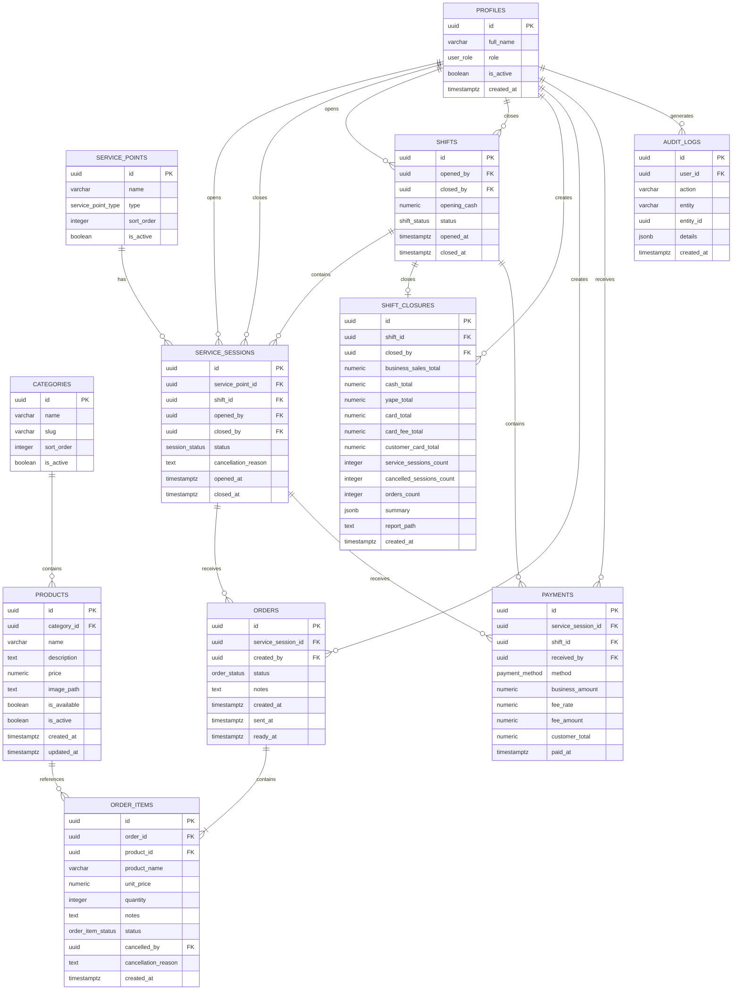

# ERD v2 FINAL — KUCHI'S

## 1. Estado del documento

**Versión:** 2.0  
**Estado:** Aprobado para implementación  
**Base de datos objetivo:** PostgreSQL desplegado en Supabase  
**Aplicaciones soportadas:**

- KUCHI'S Clientes
- KUCHI'S Logístico

Este documento reemplaza al ERD v1 y consolida todas las decisiones funcionales y técnicas tomadas antes de crear físicamente la base de datos.

---

# 2. Objetivo del modelo

El modelo de datos de KUCHI'S debe permitir:

- mantener una carta única de productos;
- servir la carta pública a KUCHI'S Clientes;
- permitir simulaciones de pedido sin crear ventas reales;
- administrar usuarios internos y roles;
- manejar 7 mesas y 4 posiciones de barra;
- registrar múltiples atenciones por cada punto de servicio;
- registrar comandas y sus productos;
- conservar precios históricos;
- registrar pagos;
- gestionar turnos;
- guardar cierres de turno;
- consultar historial detallado por fecha;
- consultar qué ocurrió en cada mesa/barra durante un turno;
- mantener trazabilidad para futuras funciones, como inventario o analítica.

---

# 3. Principios principales del diseño

## 3.1. Dos aplicaciones, una fuente de datos

```text
KUCHI'S CLIENTES
        |
        | consulta
        v
 categories / products
        |
        v
     Backend
        |
        v
 PostgreSQL / Supabase


KUCHI'S LOGÍSTICO
        |
        | operaciones internas
        v
 profiles
 service_points
 service_sessions
 orders
 order_items
 payments
 shifts
 shift_closures
 audit_logs
```

Ambas plataformas comparten la misma base de datos.

---

# 4. KUCHI'S Clientes

KUCIHI'S Clientes utilizará principalmente:

```text
categories
products
```

El simulador de pedido no generará una venta real.

Durante el MVP:

```text
Simulación
= productos seleccionados
+ cantidades
+ subtotal
+ método de pago estimado
+ posible recargo de tarjeta
```

La simulación se mantiene en el frontend y no crea:

- `service_sessions`;
- `orders`;
- `order_items`;
- `payments`;
- `shifts`.

---

# 5. Puntos de servicio

Se utiliza:

```text
service_points
```

en lugar de una tabla limitada a mesas.

Esto permite representar:

```text
TABLE = Mesa
BAR   = Posición de barra
```

Datos físicos iniciales:

```text
Mesa 1
Mesa 2
Mesa 3
Mesa 4
Mesa 5
Mesa 6
Mesa 7

Barra 1
Barra 2
Barra 3
Barra 4
```

Total:

```text
11 puntos de servicio
```

---

# 6. `is_active` NO significa ocupado

Un punto puede existir pero estar deshabilitado temporalmente.

Ejemplo:

```text
Barra 4
is_active = false
```

significa:

> Barra 4 no está habilitada actualmente.

No significa:

> Barra 4 está libre u ocupada.

La ocupación se calcula mediante `service_sessions`.

---

# 7. Sesiones de atención

Una mesa física puede atender muchos grupos durante un mismo turno.

Por eso:

```text
service_points
```

representa el lugar físico.

Mientras que:

```text
service_sessions
```

representa cada atención concreta.

Ejemplo:

```text
Mesa 1
|
+-- Atención A
|   18:02 -> 18:47
|
+-- Atención B
|   19:10 -> 19:55
|
+-- Atención C
|   20:16 -> 20:59
|
+-- Atención D
    21:24 -> 22:02
```

Las cuatro atenciones pertenecen a la misma Mesa 1, pero son clientes diferentes.

Esto permite consultar el historial detallado posteriormente.

---

# 8. Historial detallado

El historial NO se guardará en una única tabla genérica llamada `history`.

Los datos históricos ya se conservan mediante relaciones:

```text
shifts
 |
 +-- service_sessions
 |       |
 |       +-- orders
 |       |      |
 |       |      +-- order_items
 |       |
 |       +-- payments
 |
 +-- shift_closures
```

Esto permite consultar:

```text
Turno del 16/08/2026
|
+-- Mesa 1 - Atención 1
|     +-- comandas
|     +-- productos
|     +-- cantidades
|     +-- precios
|     +-- pago
|
+-- Mesa 1 - Atención 2
|
+-- Mesa 4 - Atención 1
|
+-- Barra 2 - Atención 1
|
...
```

---

# 9. Cierre de turno

Se agrega:

```text
shift_closures
```

Esta tabla representa la fotografía definitiva de un turno una vez cerrado.

La relación es:

```text
shifts
  |
  | 1 : 1
  v
shift_closures
```

Un turno puede tener como máximo un cierre oficial.

---

# 10. Snapshot del cierre

`shift_closures` almacenará valores agregados:

- venta real total;
- efectivo;
- Yape;
- tarjeta;
- recargos POS;
- total pagado por clientes con tarjeta;
- número de atenciones;
- número de atenciones canceladas;
- número de comandas;
- resumen JSON;
- posible ruta futura de reporte.

El detalle completo NO se duplicará dentro del cierre.

Para ver qué pidió una mesa se consultará:

```text
service_sessions
      |
      v
orders
      |
      v
order_items
```

---

# 11. Historial por calendario

La futura interfaz podrá consultar:

```text
Fecha
  |
  v
Shift
  |
  v
Shift Closure
```

Ejemplo:

```text
16/08/2026

Venta total: S/ 1,140.00
Efectivo:    S/   420.00
Yape:        S/   390.00
Tarjeta:     S/   330.00
POS:         S/    16.50

Atenciones: 52
Comandas:   79

[ Ver detalle ]
```

Al ingresar al detalle:

```text
Mesa 1
 +-- Atención 1
 +-- Atención 2
 +-- Atención 3
 +-- Atención 4

Mesa 2
 +-- Atención 1
 +-- Atención 2

...

Barra 4
 +-- Atención 1
```

---

# 12. Diagrama entidad-relación



---

# 13. Entidad `profiles`

Representa la información interna del trabajador.

Supabase Auth almacenará credenciales.

`profiles` almacenará datos propios de KUCHI'S.

| Campo | Tipo | Función |
|---|---|---|
| `id` | UUID | Identificador relacionado con `auth.users`. |
| `full_name` | VARCHAR | Nombre completo. |
| `role` | ENUM | Rol del usuario. |
| `is_active` | BOOLEAN | Indica si la cuenta está habilitada. |
| `created_at` | TIMESTAMPTZ | Fecha de creación. |

Roles iniciales:

```text
ADMIN
CASHIER
HALL
GRILL
```

---

# 14. Entidad `categories`

Agrupa productos.

| Campo | Tipo | Función |
|---|---|---|
| `id` | UUID | Identificador. |
| `name` | VARCHAR | Nombre visible. |
| `slug` | VARCHAR | Identificador amigable. |
| `sort_order` | INTEGER | Orden visual. |
| `is_active` | BOOLEAN | Categoría habilitada o deshabilitada. |

Ejemplos:

```text
Salchipapas
Hamburguesas
Combos
Bebidas
```

---

# 15. Entidad `products`

Representa cada producto de la carta.

| Campo | Tipo | Función |
|---|---|---|
| `id` | UUID | Identificador. |
| `category_id` | UUID FK | Categoría asociada. |
| `name` | VARCHAR | Nombre. |
| `description` | TEXT | Descripción. |
| `price` | NUMERIC(10,2) | Precio actual. |
| `image_path` | TEXT | Ruta en Supabase Storage. |
| `is_available` | BOOLEAN | Disponible actualmente. |
| `is_active` | BOOLEAN | Sigue formando parte del sistema. |
| `created_at` | TIMESTAMPTZ | Creación. |
| `updated_at` | TIMESTAMPTZ | Última modificación. |

Diferencia:

```text
is_available = false
```

Producto temporalmente agotado.

```text
is_active = false
```

Producto retirado de la carta.

---

# 16. Entidad `service_points`

Representa cualquier punto físico de atención.

| Campo | Tipo | Función |
|---|---|---|
| `id` | UUID | Identificador. |
| `name` | VARCHAR | Mesa 1, Barra 2, etc. |
| `type` | ENUM | `TABLE` o `BAR`. |
| `sort_order` | INTEGER | Orden visual. |
| `is_active` | BOOLEAN | Punto habilitado. |

---

# 17. Entidad `shifts`

Representa cada turno operativo.

| Campo | Tipo | Función |
|---|---|---|
| `id` | UUID | Identificador. |
| `opened_by` | UUID FK | Usuario que abrió. |
| `closed_by` | UUID FK | Usuario que cerró. |
| `opening_cash` | NUMERIC(10,2) | Efectivo inicial. |
| `status` | ENUM | `OPEN` o `CLOSED`. |
| `opened_at` | TIMESTAMPTZ | Apertura. |
| `closed_at` | TIMESTAMPTZ | Cierre. |

---

# 18. Entidad `shift_closures`

Representa el resumen definitivo del turno.

| Campo | Tipo | Función |
|---|---|---|
| `id` | UUID | Identificador. |
| `shift_id` | UUID FK UNIQUE | Turno cerrado. |
| `closed_by` | UUID FK | Usuario que generó el cierre. |
| `business_sales_total` | NUMERIC(10,2) | Venta real de KUCHI'S. |
| `cash_total` | NUMERIC(10,2) | Ventas pagadas en efectivo. |
| `yape_total` | NUMERIC(10,2) | Ventas pagadas mediante Yape. |
| `card_total` | NUMERIC(10,2) | Venta real pagada con tarjeta. |
| `card_fee_total` | NUMERIC(10,2) | Total de recargos POS. |
| `customer_card_total` | NUMERIC(10,2) | Total pagado por clientes con tarjeta incluyendo recargo. |
| `service_sessions_count` | INTEGER | Número de atenciones terminadas. |
| `cancelled_sessions_count` | INTEGER | Atenciones canceladas. |
| `orders_count` | INTEGER | Número de comandas. |
| `summary` | JSONB | Snapshot agregado del cierre. |
| `report_path` | TEXT | Ruta futura de PDF/CSV generado. |
| `created_at` | TIMESTAMPTZ | Momento del cierre. |

Ejemplo de `summary`:

```json
{
  "sales": {
    "business_total": 1140.00,
    "cash": 420.00,
    "yape": 390.00,
    "card": 330.00,
    "card_fee": 16.50
  },
  "counts": {
    "service_sessions": 52,
    "cancelled_sessions": 2,
    "orders": 79
  }
}
```

El JSON es solo un snapshot.

Los pedidos detallados continúan en las tablas relacionales.

---

# 19. Entidad `service_sessions`

Representa una atención individual.

| Campo | Tipo | Función |
|---|---|---|
| `id` | UUID | Identificador. |
| `service_point_id` | UUID FK | Mesa/barra. |
| `shift_id` | UUID FK | Turno asociado. |
| `opened_by` | UUID FK | Usuario que abrió. |
| `closed_by` | UUID FK | Usuario que cerró. |
| `status` | ENUM | Estado. |
| `cancellation_reason` | TEXT | Motivo si se cancela. |
| `opened_at` | TIMESTAMPTZ | Apertura. |
| `closed_at` | TIMESTAMPTZ | Cierre. |

Estados:

```text
OPEN
AWAITING_PAYMENT
PAID
CANCELLED
```

---

# 20. Entidad `orders`

Representa una comanda.

Una sesión puede generar múltiples comandas.

| Campo | Tipo | Función |
|---|---|---|
| `id` | UUID | Identificador. |
| `service_session_id` | UUID FK | Atención asociada. |
| `created_by` | UUID FK | Usuario que la creó. |
| `status` | ENUM | Estado de cocina. |
| `notes` | TEXT | Observación general. |
| `created_at` | TIMESTAMPTZ | Creación. |
| `sent_at` | TIMESTAMPTZ | Envío a parrilla. |
| `ready_at` | TIMESTAMPTZ | Momento en que quedó lista. |

Estados:

```text
PENDING
PREPARING
READY
CANCELLED
```

---

# 21. Entidad `order_items`

Representa cada producto dentro de una comanda.

| Campo | Tipo | Función |
|---|---|---|
| `id` | UUID | Identificador. |
| `order_id` | UUID FK | Comanda. |
| `product_id` | UUID FK | Producto original. |
| `product_name` | VARCHAR | Nombre congelado. |
| `unit_price` | NUMERIC(10,2) | Precio congelado. |
| `quantity` | INTEGER | Cantidad. |
| `notes` | TEXT | Observación específica. |
| `status` | ENUM | Estado del item. |
| `cancelled_by` | UUID FK | Quién anuló. |
| `cancellation_reason` | TEXT | Motivo. |
| `created_at` | TIMESTAMPTZ | Creación. |

Estados:

```text
ACTIVE
CANCELLED
```

---

# 22. Historial de precios

Nunca se recalculará una venta histórica usando:

```text
products.price
```

Se utilizará:

```text
order_items.unit_price
```

Ejemplo:

```text
Día 1
Salchipapa = S/10

Día 30
Salchipapa = S/12
```

La venta del día 1 continuará:

```text
unit_price = 10
```

---

# 23. Entidad `payments`

Representa los pagos.

| Campo | Tipo | Función |
|---|---|---|
| `id` | UUID | Identificador. |
| `service_session_id` | UUID FK | Atención pagada. |
| `shift_id` | UUID FK | Turno. |
| `received_by` | UUID FK | Usuario que registró. |
| `method` | ENUM | Método de pago. |
| `business_amount` | NUMERIC(10,2) | Dinero real de KUCHI'S. |
| `fee_rate` | NUMERIC(5,4) | Tasa del POS. |
| `fee_amount` | NUMERIC(10,2) | Recargo. |
| `customer_total` | NUMERIC(10,2) | Total pagado por cliente. |
| `paid_at` | TIMESTAMPTZ | Momento del pago. |

Métodos:

```text
CASH
YAPE
CARD
```

Ejemplo tarjeta:

```text
business_amount = 40.00
fee_rate        = 0.05
fee_amount      = 2.00
customer_total  = 42.00
```

---

# 24. Entidad `audit_logs`

Registra operaciones sensibles.

| Campo | Tipo | Función |
|---|---|---|
| `id` | UUID | Identificador. |
| `user_id` | UUID FK | Usuario responsable. |
| `action` | VARCHAR | Acción. |
| `entity` | VARCHAR | Tipo de entidad. |
| `entity_id` | UUID | Registro afectado. |
| `details` | JSONB | Detalles. |
| `created_at` | TIMESTAMPTZ | Momento. |

Ejemplo:

```json
{
  "old_price": 10.00,
  "new_price": 12.00
}
```

---

# 25. Enumeraciones

## `user_role`

```text
ADMIN
CASHIER
HALL
GRILL
```

## `service_point_type`

```text
TABLE
BAR
```

## `shift_status`

```text
OPEN
CLOSED
```

## `session_status`

```text
OPEN
AWAITING_PAYMENT
PAID
CANCELLED
```

## `order_status`

```text
PENDING
PREPARING
READY
CANCELLED
```

## `order_item_status`

```text
ACTIVE
CANCELLED
```

## `payment_method`

```text
CASH
YAPE
CARD
```

---

# 26. Relaciones principales

## Catálogo

```text
categories
    |
    +----< products
```

---

## Atención

```text
service_points
    |
    +----< service_sessions
```

---

## Turnos

```text
shifts
   |
   +----< service_sessions
   |
   +----< payments
   |
   +---- shift_closures
```

---

## Pedidos

```text
service_sessions
    |
    +----< orders
             |
             +----< order_items
```

---

## Pagos

```text
service_sessions
    |
    +----< payments
```

---

# 27. Regla: una sola sesión activa por punto

No podrá existir:

```text
Mesa 1
|
+-- OPEN
|
+-- OPEN
```

Tampoco:

```text
Mesa 1
|
+-- AWAITING_PAYMENT
|
+-- OPEN
```

Mientras una sesión esté:

```text
OPEN
```

o:

```text
AWAITING_PAYMENT
```

el punto continúa ocupado.

---

# 28. Regla: un solo turno abierto

Durante el MVP solo existirá un turno operativo abierto simultáneamente.

```text
Turno A = OPEN
Turno B = OPEN   <- inválido
```

---

# 29. Regla: un cierre por turno

`shift_closures.shift_id` será único.

```text
Turno #40
|
+-- Cierre #1
```

No podrá existir un segundo cierre oficial del mismo turno.

---

# 30. Regla: cierre histórico

Una vez generado un cierre:

```text
shift_closures
```

debe considerarse un registro histórico.

Las correcciones posteriores deberán quedar auditadas y no reemplazar silenciosamente el historial.

---

# 31. Regla: cantidades

```text
order_items.quantity > 0
```

---

# 32. Regla: precios

```text
products.price >= 0

order_items.unit_price >= 0

payments.business_amount >= 0

payments.fee_amount >= 0

payments.customer_total >= 0
```

---

# 33. Regla: cancelaciones

Para un item cancelado:

```text
status = CANCELLED
```

debe existir:

- usuario responsable;
- motivo;
- trazabilidad.

Para una sesión cancelada también debe existir motivo.

---

# 34. Regla: pagos con tarjeta

```text
customer_total
=
business_amount
+
fee_amount
```

El recargo POS no incrementa:

```text
business_sales_total
```

---

# 35. Flujo completo de una atención

```text
Turno OPEN
    |
    v
Mesa 1 libre
    |
    v
Crear service_session
    |
    v
Mesa 1 ocupada
    |
    v
Crear order
    |
    v
Crear order_items
    |
    v
Parrilla
PENDING
    |
    v
PREPARING
    |
    v
READY
    |
    v
Cliente solicita cuenta
    |
    v
AWAITING_PAYMENT
    |
    v
Crear payment
    |
    v
service_session = PAID
    |
    v
closed_by
closed_at
    |
    v
Mesa 1 libre
```

---

# 36. Flujo de cierre de turno

```text
Caja presiona
"Cerrar turno"
       |
       v
Backend valida
       |
       +-- no hay sesiones activas pendientes
       |
       v
Calcula ventas
       |
       +-- efectivo
       +-- Yape
       +-- tarjeta
       +-- recargo POS
       +-- atenciones
       +-- cancelaciones
       +-- comandas
       |
       v
Cierra shifts
       |
       v
Crea shift_closures
       |
       v
Guarda summary JSONB
       |
       v
Turno histórico disponible
```

---

# 37. Ejemplo de historial detallado

```text
16/08/2026
Turno #24

Venta KUCHI'S: S/1,140
Atenciones: 52
Comandas: 79

Mesa 1
|
+-- Atención #301
|   18:02 - 18:47
|   |
|   +-- Comanda #700
|       +-- Salchipapa x1
|       +-- Chicha x2
|   |
|   +-- Pago Yape
|
+-- Atención #318
|   19:10 - 19:55
|   |
|   +-- Comanda #744
|       +-- Hamburguesa x2
|   |
|   +-- Pago Efectivo
|
+-- Atención #336
|   20:16 - 20:59
|
+-- Atención #351
    21:24 - 22:02
```

Este historial no requiere duplicar la información.

Se reconstruye mediante relaciones.

---

# 38. Posible uso futuro para inventario

Aunque inventario NO forma parte del MVP, el historial permite posteriormente consultar:

```text
¿Cuántas hamburguesas se vendieron hoy?

¿Cuántas salchipapas se vendieron este mes?

¿Qué producto se vende más los sábados?

¿Qué bebida se vende más por turno?
```

Esto será posible utilizando:

```text
order_items
```

sin modificar el historial actual.

---

# 39. Soft delete

Los registros históricos importantes no deben borrarse físicamente.

Principalmente:

```text
products
service_points
profiles
```

utilizarán estados como:

```text
is_active = false
```

para conservar las relaciones históricas.

---

# 40. Archivos de reporte

En una fase futura el sistema podrá generar:

```text
PDF
CSV
```

por cada cierre.

La ruta podrá guardarse en:

```text
shift_closures.report_path
```

Ejemplo:

```text
shift-reports/
2026/
08/
shift-2026-08-16.pdf
```

La fuente oficial seguirá siendo PostgreSQL.

El archivo será solo una representación exportable.

---

# 41. Entidades finales del ERD v2

```text
profiles

categories
products

service_points
service_sessions

orders
order_items

payments

shifts
shift_closures

audit_logs
```

Total:

```text
11 tablas propias de KUCHI'S
```

Además:

```text
auth.users
```

será administrada por Supabase Auth.

---

# 42. Dependencias principales

```text
auth.users
    |
    v
profiles


categories
    |
    v
products


service_points
    |
    v
service_sessions
    |
    +------> orders
    |          |
    |          v
    |      order_items
    |
    +------> payments


shifts
    |
    +------> service_sessions
    |
    +------> payments
    |
    +------> shift_closures
```

---

# 43. Próximo paso

Con este ERD v2 aprobado se debe actualizar la primera migración física.

Archivo objetivo:

```text
supabase/migrations/<timestamp>_initial_schema.sql
```

El esquema deberá incluir:

1. enums;
2. tablas;
3. claves primarias;
4. claves foráneas;
5. restricciones;
6. índices;
7. una sesión activa por punto;
8. un turno abierto;
9. un cierre por turno;
10. `closed_by` en `service_sessions`;
11. `shift_closures`;
12. triggers;
13. RLS;
14. permisos iniciales.

Después:

```text
Crear proyecto Supabase
        |
        v
Configurar CLI
        |
        v
Vincular proyecto
        |
        v
Aplicar migración
```

---

# 44. Estado final

```text
ERD VERSION: 2.0
STATUS: FINAL PARA IMPLEMENTACIÓN
DATABASE: PostgreSQL / Supabase
CLIENT APP: soportada
LOGISTICS APP: soportada
HISTORICAL DATA: soportada
DETAILED SHIFT HISTORY: soportada
MULTIPLE SERVICE POINT ROTATIONS: soportadas
FUTURE INVENTORY ANALYTICS: preparada
```
